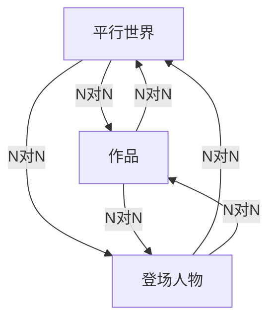
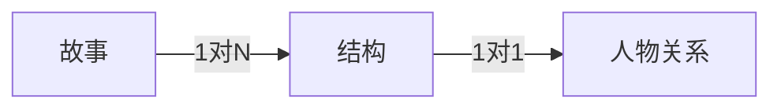

# GalgameCharacterConnector

Galgame策划层的统一建模语言，为脚本&原案提供清晰的剧情流，梳理故事脉络。

## 前言

本文档正在从飞书文档向Github迁移，[原文档](https://bytedance.feishu.cn/docs/doccnBVmeV7Ses6AO0rI0hpCQgg#)包含较丰富的飞书文档特有元素，需要花费一定时间。

此外，原文档中包含的Neo4j简介，可以考虑使用更为详尽的公有领域的Neo4j教程链接嵌入到文章中的形式来实现，本仓库目标是仅存放具体的实现而不存放基础语法的教学。

## 图数据库简介

按现有个人业务创建图数据库，分为「里世界（story）、表时间（web）、现实世界（reality）」三个大脉络图谱；皆具备单一实体「individual」，其属性与属性值见下表：

关于类无向图的约定：由于neo4j中无法记录无向关联，故在此针对部分双向关系进行约定；

+ 关联信息写为双方关系（如父子、朋友、同学等），整个系统中不应存在双向关联；
+ 节点&关系指向仅创建一次，且一律设置为指向他人，由先来后到的次序进行建立（如A认识B，B认识A也认识C，若按A、B、C的顺序填写，则，A创建A→B并填写关系；B创建B→C并填写关系，C不创建也不填写关系，但三者都有修改关联信息的权限）；如果为story中填写，则主作者按扩散关系逐个代入填写（由中心人物向外发散一轮，进行完毕后逐个代入角色继续增加二轮关系，以此类推）
+ 不同世界中的主体可通过「唯一生物编号」进行关联，其关联关系可记录于关系型数据库中↓

| 唯一生物编号 | 里世界   | 表世界   | 现实世界 | 备注 |
| ------------ | -------- | -------- | -------- | ---- |
| 001          | 张和id   | 同和君id | 何承翰id |      |
| 002          | 李梓豪id | 何白渝id | 吕国勇id |      |
| ……           | ……       | ……       | ……       |      |

### **CRUD**相关代码

#### 1.创建节点

##### 1.1里世界

```
SQL
merge (p:PersonStory{
personStoryId:"",
personStoryName:"",
personStorySex:"",
personStoryInfo:"",
personStoryFeature:""  
}) return p  
```

##### 1.2表世界

```
SQL  
merge (p:PersonWeb{
personWebId:"",
personWebName:"",
personWebPlatform:"",
personWebInfo:"",
personWebField:"",
personWebKey:""
}) 
return p  
```

##### 1.3现实世界

```
SQL
merge (p:PersonReality{
personRealityId:"",
personRealityName:"",
personRealitySex:"",
personRealityBrithday:"",
personRealityInfo:"",
personRealityFeature:"",
personRealityKey:"",
personRealityAbility:""  
})
return p  
```

#### 2.创建关系

##### 2.1里世界

```
SQL
match(pa:PersonStory{
personStoryId:""  
}),(pb:PersonStory{
personStoryId:""  
}) merge (pa)-[c:ConnectStory{
"connectStoryId":  "",
"connectStoryName":"",
"connectStoryInfo":""
}]->(pb) return pa,pb,c  
```

##### 2.2表世界

```
SQL  match(pa:PersonWeb{
personWebId:""  
}),(pb:PersonWeb{
personWebId:""  
}) merge (pa)-[c:ConnectWeb{
"connectWebId":  "",
"connectWebName":"",
"connectWebInfo":""  
}]->(pb) return pa,pb,c  
```

##### 2.3现实世界

```
SQL
match(pa:PersonReality{
personRealityId:""
}),(pb:PersonReality{
personRealityId:""
}) merge (pa)-[c:ConnectReality{
"connectRealityId":  "",
"connectRealityName":"",
"connectRealityInfo":""
}]->(pb) return pa,pb,c
```

#### 3.呈现脉络

（**创建后将中心移动至新节点或新连接**）

##### 3.1里世界

```
SQL
MATCH (p:PersonStory) RETURN p  
```

##### 3.2表世界

```
SQL
MATCH (p:PersonWeb) RETURN p  
```

##### 3.3现实世界

```
SQL
MATCH (p:PersonReality) RETURN p  
```

#### 4.修改节点

##### 4.1里世界

第一步：返回节点详情

```
SQL
MATCH (p:PersonStory{
personStoryId:""
}) RETURN p  
```

第二步：更新节点详情

```
SQL
MATCH (p:PersonStory{
personStoryId: ""
})
SET p.personStoryName = "",
p.personStorySex = "",
p.personStoryInfo = "",
p.personStoryFeature = ""
RETURN p
```

##### 4.2表世界

第一步：返回节点详情

```
SQL
MATCH (p:PersonWeb{
personWebId:""
}) RETURN p
```

第二步：更新节点详情

```
SQL
MATCH (p:PersonWeb{
personWebId:""
})
SET p.personWebName = "",
p.personWebPlatform = "",
p.personWebField = "",
p.personWebInfo = "",
p.personWebKey = ""
RETURN p
```

##### 4.3现实世界

第一步：返回节点详情

```
SQL
MATCH (p:PersonReality{
personRealityId:""
}) RETURN p
```

第二步：更新节点详情

```
SQL
MATCH (p:PersonReality{
personRealityId:""
})
SET p.personRealityName = "",
p.personRealitySex =  "",
p.personRealityBrithday = "",
p.personRealityInfo =  "",
p.personRealityFeature = "",
p.personRealityKey = "",
p.personRealityAbility = ""
RETURN p
```

#### 5.修改关系

##### 5.1里世界

第一步：返回连接详情

```
SQL  MATCH ()-[c:ConnectStory{
connectStoryId:""
}]-()  RETURN c
```

第二步：更新连接详情

```
SQL  MATCH ()-[c:ConnectStory{
connectStoryId:""  
}]-()  
SET c.connectStoryName = "",
c.connectStoryInfo = ""
RETURN c
```

##### 5.2表世界

第一步：返回连接详情

```
SQL  MATCH ()-[c:ConnectWeb{
connectWebId:""
}]-()  RETURN c
```

第二步：更新连接详情

```
SQL  MATCH ()-[c:ConnectWeb{
connectWebId:""  }]-()
SET  c.connectWebName = "",
c.connectWebInfo = ""
RETURN c
```

##### 5.3现实世界

第一步：返回连接详情

```
SQL
MATCH ()-[c:ConnectReality{
connectRealityId:""
}]-()  RETURN c
```

第二步：更新连接详情

```
SQL
MATCH ()-[c:ConnectReality{
connectRealityId:""
}]-()
SET c.connectRealityName = "",
c.connectRealityInfo =  ""
RETURN c
```

#### 6.删除节点

##### 6.1里世界

```
SQL
MATCH (p:PersonStory{
personStoryId:""
})   DELETE p  
```

##### 6.2表世界

```
SQL
MATCH (p:PersonWeb{
personWebId:""
})   DELETE p  
```

##### 6.3现实世界

```
SQL
MATCH (p:PersonReality{
personRealityId:""
})   DELETE p
```

#### 7.删除关系

##### 7.1里世界

```
SQL
MATCH ()-[c:ConnectStory{
connectStoryId:""
}]-()  DELETE c
```

##### 7.2表世界

```
SQL
MATCH ()-[c:ConnectWeb{
connectWebId:""
}]-()  DELETE c
```

##### 7.3现实世界

```
SQL
MATCH ()-[c:ConnectReality{
connectRealityId:""
}]-()  DELETE c
```

### 后端代码

SpringBoot（框架）+Mybatis（持久层组件）+org.neo4j.driver.v1（数据库插件）

### 前端代码

vue.js（框架）+Echarts（渲染插件）

### 参考资料

https://blog.csdn.net/qq_34661106/article/details/103540826

https://blog.csdn.net/uniquewonderq/article/details/80924347

https://github.com/whl6785968/BackstageWaterForG

https://github.com/AntMxs/MyNeo4j

https://github.com/neo4j-contrib/neo4j-jdbc

### 项目细化



由于实际需求更加细化，故在此继续完善设计；由于Story层不同于Web和Reality层，普通的世界仅由一维时间构成，而故事里可以存在多个平行世界，这些平行世界又可以对应不同的故事（作品与平行世界的对应关系为N对N），每个故事里出现的人物又可以同时存在于各类平行世界中……所以需要在所有关系的上层加入一个时间轴来归纳区分，将各类关系进一步低耦合，具体设计如下：

#### 1.时间轴

时间层选用桑葚图，其节点为起点、终点、枢纽点（枢纽点又可细化为分歧点与收束点），节点属性包含节点id、基本信息（如观测者状态切片、客观背景切片）、节点种类、节点变动（分歧&收束）详情（仅枢纽点包含）；边的属性为结构id、结构梗概、包含人物、结构编码（如1-1、1-2）、结构标题（俗称XX线、XX篇章）；

 

※人与时间的关系：游离、静态、无关变量。

#### 2.人物关系

刚刚已经通过时间轴拆分了平行世界的复杂关系，那么关系会改变为：一个故事包含多个结构（这些结构可以存在于同一或不同的平行世界上，相当于对平行世界这个概念做了解耦）、每个结构对应了不同的人物关系，而人物节点本身是不变的，可以被所有结构进行引用；



### 使用流程

此处仅讨论故事侧的使用流程，首先分为3个模块：创建角色、创建故事、创建单个故事结构图与创建各结构下的人脉关系；创建角色和创建故事比较简单，常规表格的CRUD；创建完毕后去到故事结构图，新建默认为「起点→枢纽点」+「枢纽点→终点」，默认创建的这些是不能被删除的；点击按钮可新建枢纽点和结构（点击后弹出对话框，填写完毕后提交后台新增），右击已创建的点与边可以修改；

一期：左击边可选中，点击其他边时，原先选中的边失去高光，高亮新选中的边；

二期：左击边可选中，再左击取消选中，即可以一次性选中多条边，左击点可选中与该点相连接的所有边；

选中后下方会以连接图的方式出现所选边对应的人脉关系，点击人脉关系中的点与边即可实时修改。
